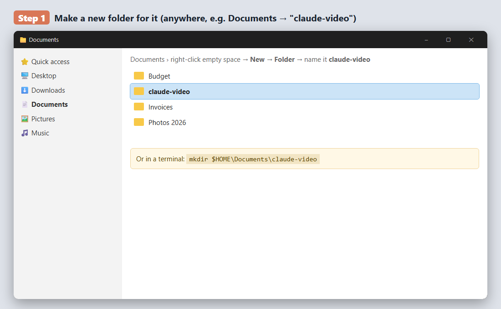
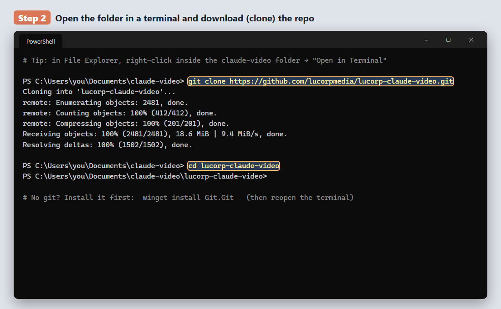
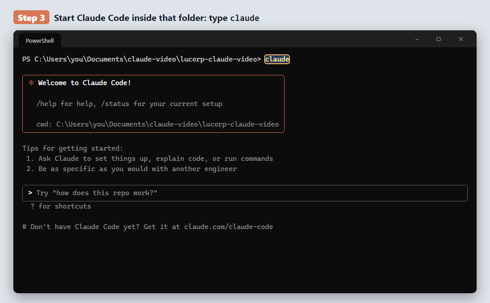
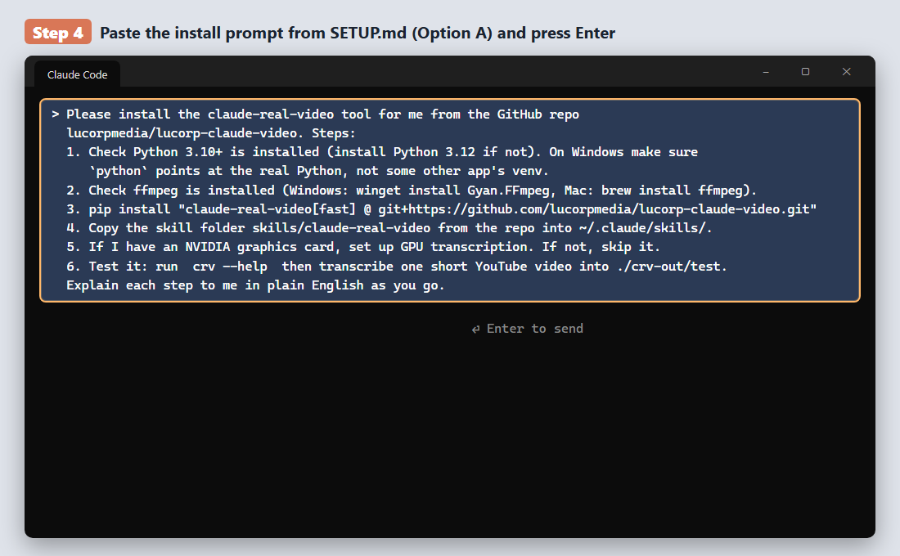
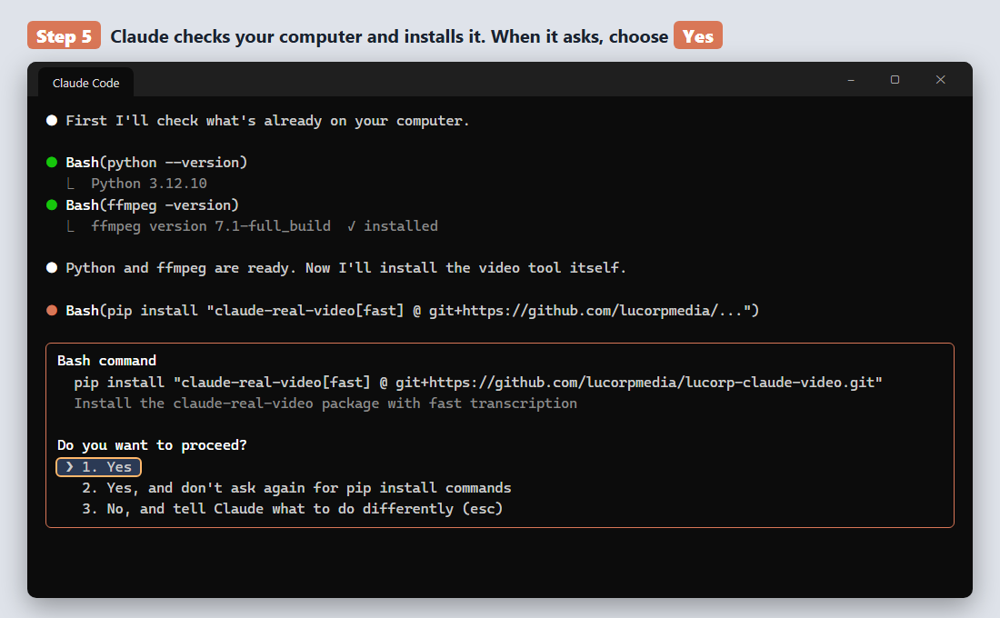
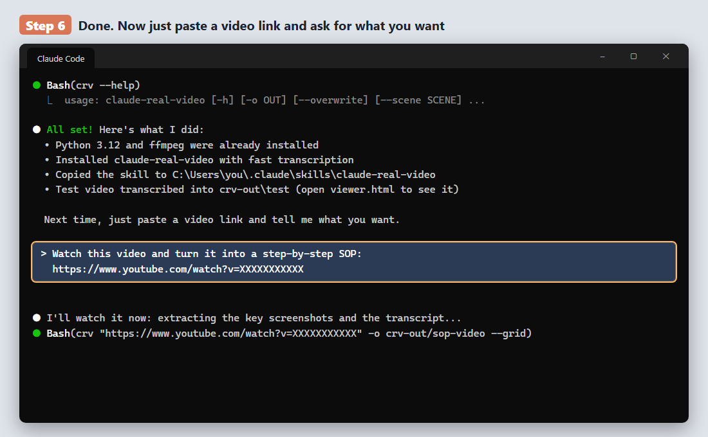

# Setup: let your AI watch videos (the easy way)

**What this is:** a tool that lets Claude "watch" a video. You give it a YouTube link or a video file.
It pulls out the important pictures (every time the screen changes) and writes down everything
that's said. Claude then reads those and can summarize the video, take notes, or answer questions
about it with exact timestamps.

This fork adds:
- a **clickable transcript page** (`viewer.html`): click any line and the video jumps there
- automatic **CPU fallback**, so it still works on computers without an NVIDIA graphics card

---

## Step by step with pictures (Windows)

*Illustrations of each screen. Your paths and version numbers may look a little different.*

**1. Make a new folder for it.**


**2. Open that folder in a terminal and download the repo.**


**3. Start Claude Code inside the repo folder.**


**4. Paste the install prompt (the grey box in Option A below) and press Enter.**


**5. Claude checks your computer and installs everything. Choose "Yes" when it asks.**


**6. Done. Paste any video link and say what you want.**


---

## Option A: let the AI install it for you (easiest)

1. Install **Claude Code** if you don't have it: https://claude.com/claude-code
2. Open Claude Code in any folder.
3. Copy this whole box and paste it in, then press Enter:

```
Please install the claude-real-video tool for me from the GitHub repo
lucorpmedia/lucorp-claude-video. Steps:
1. Check Python 3.10+ is installed (install Python 3.12 if not). On Windows make sure
   `python` points at the real Python, not some other app's venv.
2. Check ffmpeg is installed (Windows: winget install Gyan.FFmpeg, Mac: brew install ffmpeg).
3. pip install "claude-real-video[fast] @ git+https://github.com/lucorpmedia/lucorp-claude-video.git"
   (if the folder is inside Dropbox/OneDrive and the install fails with "WinError 32",
   clone it to a normal folder first and install from there).
4. Copy the skill folder skills/claude-real-video from the repo into ~/.claude/skills/.
5. If I have an NVIDIA graphics card, set up GPU transcription (faster-whisper + the
   nvidia-cublas-cu12 / nvidia-cudnn-cu12 pip packages on PATH). If not, skip it.
6. Test it: run  crv --help  then transcribe one short YouTube video into ./crv-out/test.
Explain each step to me in plain English as you go.
```

4. Say yes when it asks permission to run things. Done.

---

## Option B: do it yourself (5 steps)

**1. Install Python** (the language the tool is written in)
- Windows: https://www.python.org/downloads/ → download → run it → **tick "Add python.exe to PATH"** → Install.
- Mac: `brew install python@3.12`

**2. Install ffmpeg** (the video engine)
- Windows: open PowerShell and run `winget install Gyan.FFmpeg`
- Mac: `brew install ffmpeg`

Close and reopen your terminal after steps 1 and 2.

**3. Install the tool.**
```
pip install "claude-real-video[fast] @ git+https://github.com/lucorpmedia/lucorp-claude-video.git"
```

**4. Give Claude the skill** (so it knows how to use the tool)
```
git clone https://github.com/lucorpmedia/lucorp-claude-video.git
```
Copy the folder `lucorp-claude-video/skills/claude-real-video` into:
- Windows: `C:\Users\<you>\.claude\skills\`
- Mac: `~/.claude/skills/`

**5. Check it works**
```
crv --help
```
If you see a help page, you're done.

---

## How to use it

Just talk to Claude Code:

- "Watch this video and summarize it: https://youtube.com/..."
- "Take notes on this video: C:\Videos\call.mp4"
- "Watch this and tell me every step he shows."

Or run it yourself:
```
crv "https://youtube.com/watch?v=..." -o crv-out/my-video --grid
```

**What you get in the output folder:**
| File | What it is |
|---|---|
| `viewer.html` | Double-click it. Video plus transcript; click a line to jump there |
| `transcript.txt` | Everything that was said |
| `grids/` | Picture sheets of what was on screen |
| `MANIFEST.txt` | Summary Claude reads first |

**Handy extras**
| Want | Add |
|---|---|
| Two or more people talking (calls, podcasts) | `--speakers` (first: `pip install "claude-real-video[speakers]"`) |
| Only part of a long video | `--from 10:00 --to 25:00` |
| Screen recordings with small text | `--frame-width 1280` |
| Search everything you've ever watched | `crv-ask "guarantee"` |

---

## Practical examples (copy-paste these into Claude Code)

The real power is not "summarize this video". It's a chain:

```
VIDEO  →  transcript + screenshots  →  notes  →  SOP / rulebook  →  AI agent or skill that uses it
```

Watch once, turn it into instructions, and from then on an AI follows those instructions for you.

### 1. Quick summary of a YouTube video
```
Watch this and give me the 5 key takeaways with timestamps:
https://www.youtube.com/watch?v=XXXX
```

### 2. YouTube tutorial → SOP (a step-by-step checklist)
```
Watch this tutorial: https://www.youtube.com/watch?v=XXXX
File it under crv-out/<category>/<creator>/01-<topic>.
Then write an SOP in sop.md: numbered steps, exact settings/buttons/numbers shown on
screen (read the screenshots, not just the audio), what to check at the end, and
common mistakes he warns about. Tag each step with its timestamp.
```
Tip: for screen recordings, ask for `--frame-width 1280` so small text is readable.

### 3. SOP → an AI agent that does the work
Once you have `sop.md`, turn it into a skill so any future Claude session follows it:
```
Turn crv-out/<category>/<creator>/01-<topic>/sop.md into a Claude Code skill at
~/.claude/skills/<topic>/SKILL.md. The description should say exactly when to use it.
Steps must be runnable by an agent: which tools, what to check, when to stop and ask me.
```
Now just say "run the <topic> SOP" and Claude does it, step by step.

Want it to run on its own? Ask Claude to schedule it:
```
Run the <topic> skill every Monday at 9am and send me a report.
```

### 4. A whole course → a "brain" + an AI coach that reviews your work
Got a course you paid for (sales, marketing, coding)? Turn it into an AI reviewer:
```
1. Transcribe every lesson in this playlist/folder into crv-out/coaching/<coach>/NN-slug
   (keep source.mp4).
2. Write notes.md per lesson: rules, frameworks, examples, warnings, each tagged
   [lesson @mm:ss].
3. Merge all notes into one rulebook (a markdown file or a page in my notes app):
   rules by topic, duplicates merged, contradictions kept side by side.
4. Write a review scorecard page from those rules.
5. Make a skill "<coach>-ai" that loads those pages whenever I say "review this".
```
Then paste your offer, sales page or plan and ask: **"What would <coach> say?"**
You get a verdict, what fails, a rewrite, and the exact lesson and timestamp for every point.

Tip: long jobs (20+ videos) go faster if you ask Claude to "use subagents in parallel:
one per few lessons".

### 5. Recorded call → action items + memory
```
Transcribe this call with --speakers: C:\Videos\team-call.mp4
Who said what, decisions made, action items with owners and due dates,
and anything that changes our earlier plan. Save the decisions to my notes.
```

### 6. Trading video → strategy spec you can code
```
Watch this trading strategy video: <link>. File it under crv-out/trading/<creator>/01-<name>.
Write strategy.md: exact entry, exit, stop, filters, timeframe. Tag each rule [video] if he
said it and [param] if it's a number we have to choose. Then list what's needed to backtest it.
```

### 7. Competitor teardown
```
Watch these 3 competitor videos/ads: <links>. Compare their hook, offer, guarantee, price
and call to action in a table. What do all 3 do that we don't?
```

### 8. Ask across everything you've ever watched
```
crv-ask "guarantee"
```
or just ask Claude: "Across all my transcribed videos, what did anyone say about guarantees?"

---

## Keep things tidy

Put results in folders by topic, never on the Desktop:
```
crv-out/<category>/<source>/<NN-short-name>/
e.g. crv-out/marketing/some-creator/01-facebook-ads-basics
```
Keep `source.mp4` in each folder. Online videos can disappear.

---

## If something breaks

| Problem | Fix |
|---|---|
| `crv` is not recognized | Close and reopen the terminal. Still broken: reinstall Python with "Add to PATH" ticked |
| `ffmpeg not found` | Redo step 2, then reopen the terminal |
| `WinError 32` during install | You're installing from a Dropbox/OneDrive folder. Clone to `C:\temp` and install from there |
| `cublas64_12.dll is not found` | GPU libraries missing. This fork falls back to CPU automatically (slower but works). To use the GPU, ask Claude: "set up faster-whisper GPU transcription" |
| No transcript | You installed without `[fast]` or `[whisper]`. Rerun step 3 |
| Very long calls (2 h+) mix up speakers | Ask Claude to diarize in 25-minute sections |

---

## Updating

```
pip install --upgrade --force-reinstall "claude-real-video[fast] @ git+https://github.com/lucorpmedia/lucorp-claude-video.git"
```
